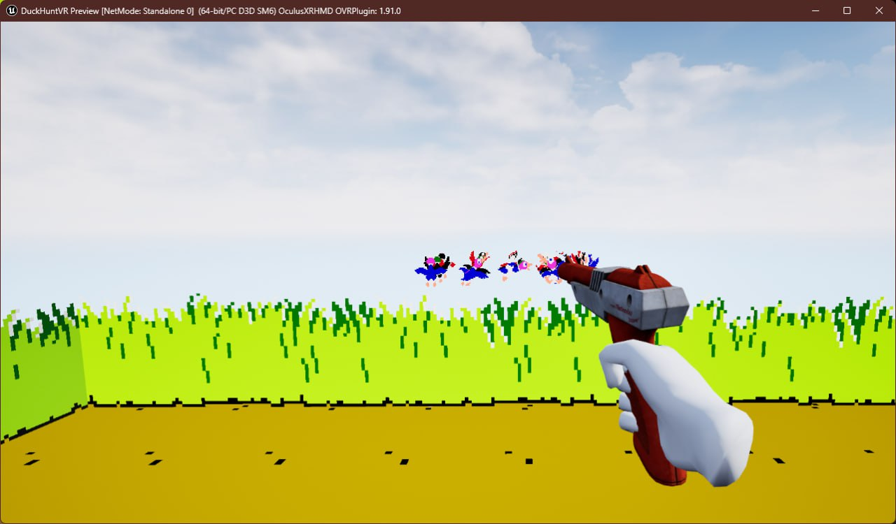
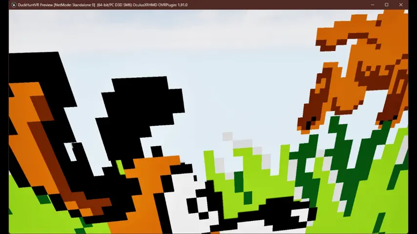

# Duck Hunt VR

## Showcase

### Sprites

### Zapper

### Hand tracking

## Dependencies

### MetaXR plugin (60.0)

* https://developer.oculus.com/downloads/package/unreal-engine-5-integration/60.0

### OculusHandTools plugin (hand tracking pose recognition)

* https://github.com/oculus-samples/Unreal-HandPoseShowcase/tree/main/Plugins/OculusHandTools

## Resources

### Original game

* https://en.wikipedia.org/wiki/Duck_Hunt

### PDF Manual

* https://archive.org/details/DuckHuntNESHiResScans

### Gameplay

* https://youtu.be/J3sfsP9W048?si=-DZhygU--Yi0hrV1
* https://www.retrogames.cz/play_1185-NES.php

### Sprite sheets

> ⚠️ Some sprites were slightly edited (for example, the dog's shadows were removed), but, in general, the original content was used.

* https://www.spriters-resource.com/nes/duckhunt/
* https://www.mariomayhem.com/downloads/sprites/duck_hunt_nes_sprites.php

### Sounds

* https://www.101soundboards.com/boards/10108-duck-hunt-sounds

### Font

* https://fontstruct.com/fontstructions/show/1332355/arcade-classic-2-19

### Hand models and animations (for controllers)

> ⚠️ Hand blueprints were rewritten in C++, and some logic was modified to:
> 1) Make hands components instead of actors
> 2) Utilize UE5 enhanced input system
> 3) Implement a custom hand pose when holding a gun
>
> However, in general, the original content (skeletal meshes and animations) was retained.

* https://github.com/oculus-samples/Unreal-Locomotion/tree/main/Content/Hands

### NES Zapper model

> ⚠️ Battery was removed.

* "NES Zapper (PBR)" (https://skfb.ly/zMSW) by Yogensia is licensed under CC Attribution-NonCommercial-ShareAlike (http://creativecommons.org/licenses/by-nc-sa/4.0/).
